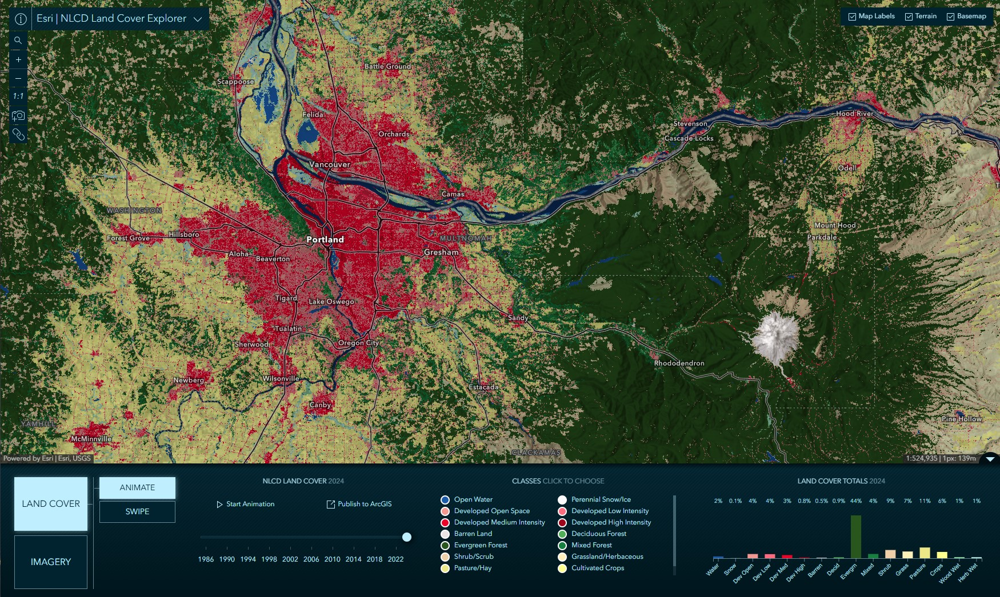

# Imagery Explorer Apps
This repository contains a collection of Imagery Explorer web applications developed by Esri's ArcGIS Living Atlas team.

## Table of Content
- [Getting Started](#getting-started)
- [Landsat Explorer](#landsat-explorer)
- [Sentinel-2 Explorer](#sentinel-2-explorer)
- [Sentinel-1 Explorer](#sentinel-1-explorer)
- [Sentinel-2 Landcover Explorer](#sentinel-2-land-cover-explorer)
- [NLCD Land Cover Explorer](#nlcd-land-cover-explorer)

## Getting Started
Before you begin, make sure you have a fresh version of [Node.js](https://nodejs.org/en/) and NPM installed. The current Long Term Support (LTS) release is an ideal starting point.

To get started, clone this repository (or your fork) to your local machine:
```sh
git clone https://github.com/Esri/imagery-explorer-apps.git
```

Navigate to the root directory of the project and install the necessary packages (dependencies):
```sh
npm install
```

## Landsat Explorer

The Landsat Explorer app offers an intuitive user experience, it leverages a variety of ArcGIS capabilities to explore and begin to unlock the wealth of information that Landsat provides. 

[View it live](https://livingatlas.arcgis.com/landsatexplorer/)


### Features:
- Visual exploration of a Dynamic global mosaic of the best available Landsat scenes.
- On-the-fly multispectral band combinations and indices for visualization and analysis.
- Interactive Find a Scene by location, sensor, time, and cloud cover.
- Visual change by time, and comparison of different renderings, with Swipe and Animation modes.
- Analysis such as threshold masking and temporal profiles for vegetation, water, land surface temperature, and more.

### Pre-requisites

#### 1. Create a service proxy for Landsat Level-2 imagery service

To run the Landsat Explorer app, you must set up a service proxy for the Landsat Level-2 imagery service. This proxy should point to the Landsat Level-2 ImageServer URL: `https://landsat.imagery1.arcgis.com/arcgis/rest/services/LandsatC2L2/ImageServer`.

This service is [available in the Living Atlas](https://www.arcgis.com/home/item.html?id=bd6b545b95654d91a0b7faf7b5e010f5) and is subscriber-only content, meaning it requires sign-in with an ArcGIS account to access. To allow the app to access this service without prompting users for authentication, you need to create a proxy service. Follow the instructions in the [ArcGIS Online documentation](https://doc.arcgis.com/en/arcgis-online/reference/arcgis-server-services.htm#ESRI_SECTION1_FEB0DF92DA064B6A970DFB59A18AA4C2) to set it up.

The proxy service URL will be used in the `.env` file as `LANDSAT_LEVEL_2_PROXY_SERVICE_URL`.

#### 2. Create an ArcGIS Application ID
To use the Landsat Explorer app, you need to create an ArcGIS Application ID. This ID is used for user authentication, which is required for features such as saving selected scenes. You can create an application ID by following the instructions in the [ArcGIS Developer documentation](https://developers.arcgis.com/documentation/security-and-authentication/app-authentication/how-to-implement-app-authentication/#2-implement-a-client-credentials-flow).

This application ID will be used in the `.env` file as `LANDSAT_EXPLORER_APP_ID`.

#### 3. Create `.env` file
Before running the application, create a `.env` file in the project root using the following template:

```sh
# Required: Application ID for Landsat Explorer
# Used to authenticate users, which is required for features such as saving selected scenes.
LANDSAT_EXPLORER_APP_ID = YOUR_LANDSAT_EXPLORER_APP_ID

# Required: Proxy service URL for Landsat Level 2 imagery service
LANDSAT_LEVEL_2_PROXY_SERVICE_URL = YOUR_LANDSAT_SERVICE_PROXY_URL

# Optional: Original service URL for Landsat Level 2 imagery service (default: https://landsat.imagery1.arcgis.com/arcgis/rest/services/LandsatC2L2/ImageServer)
LANDSAT_LEVEL_2_ORIGINAL_SERVICE_URL = https://landsat.imagery1.arcgis.com/arcgis/rest/services/LandsatC2L2/ImageServer

# Optional: Portal root URL for ArcGIS Online/Enterprise (default: https://www.arcgis.com)
ARCGIS_PORTAL_ROOT_URL = https://www.arcgis.com

# Optional: Raster Analysis GPServer root URL (default: https://rasteranalysis.arcgis.com/arcgis/rest/services/RasterAnalysisTools/GPServer)
RASTER_ANALYSIS_SERVICE_ROOT_URL = https://rasteranalysis.arcgis.com/arcgis/rest/services/RasterAnalysisTools/GPServer

```

### Usage

To run and test the app on your local machine using the `.env` file you created above:
```sh
npm run start:landsat
```

To build the app for deployment using the `.env` file:
```sh
npm run build:landsat
```

### Resources
- [Landsat Level-2 archive available in Living Atlas](https://www.esri.com/arcgis-blog/products/arcgis-living-atlas/imagery/landsat-level-2-science-products-and-landsat-explorer/)
- [Landsat Explorer: Earth Science and Observation for All](https://www.esri.com/arcgis-blog/products/arcgis-living-atlas/imagery/landsat-explorer-earth-science-and-observation-for-all/)
- [Landsat Level-2 RFTs](./assets/LandsatC2L2FunctionTemplates/): Raster Function Templates of the Landsat Level-2 service for the Raster Functions that are utilized by the app.

### Landsat Level-2 Imagery Service Licensing
- Source Image Products - USGS. USGS-authored or produced data and information are considered to be in the U.S. Public Domain and may be used without restriction. [Acknowledging or Crediting USGS](https://www.usgs.gov/information-policies-and-instructions/acknowledging-or-crediting-usgs)
- Image Service - Esri. This work is licensed under the Esri Master License Agreement. [View Summary](https://downloads2.esri.com/arcgisonline/docs/tou_summary.pdf) | [View Terms of Use](https://www.esri.com/en-us/legal/terms/full-master-agreement)

## Sentinel-2 Explorer

Sentinel-2 multispectral imagery helps to track and document land use and land change associated with climate change, urbanization, drought, wildfire, deforestation, and other natural processes, disasters, and human activity.

Through an intuitive user experience, this app leverages a variety of ArcGIS capabilities to explore and begin to unlock the wealth of information that Sentinel-2 provides. Some of the key capabilities include:

[View it live](https://livingatlas.arcgis.com/sentinel2explorer/)


### Features:
- Visual exploration of a Dynamic global mosaic of the best available Sentinel-2 scenes.
- On-the-fly multispectral band combinations and indices for visualization and analysis.
- Interactive Find a Scene by location, sensor, time, and cloud cover.
- Visual change by time, and comparison of different renderings, with Swipe and Animation modes.
- Analysis such as threshold masking and temporal profiles for vegetation, water, and more.


### Pre-requisites

#### 1. Create a service proxy for Sentinel-2 imagery service

To run the Sentinel-2 Explorer app, you must set up a service proxy for the Sentinel-2 imagery service. This proxy should point to the Sentinel-2 ImageServer URL: `https://sentinel.imagery1.arcgis.com/arcgis/rest/services/Sentinel2L2A/ImageServer`.

This service is [available in the Living Atlas](https://www.arcgis.com/home/item.html?id=255af1ceee844d6da8ef8440c8f90d00) and is subscriber-only content, meaning it requires sign-in with an ArcGIS account to access. To allow the app to access this service without prompting users for authentication, you need to create a proxy service. Follow the instructions in the [ArcGIS Online documentation](https://doc.arcgis.com/en/arcgis-online/reference/arcgis-server-services.htm#ESRI_SECTION1_FEB0DF92DA064B6A970DFB59A18AA4C2) to set it up.

The proxy service URL will be used in the `.env` file as `SENTINEL2_PROXY_SERVICE_URL`.

#### 2. Create an ArcGIS Application ID
To use the Sentinel-2 Explorer app, you need to create an ArcGIS Application ID. This ID is used for user authentication, which is required for features such as saving selected scenes. You can create an application ID by following the instructions in the [ArcGIS Developer documentation](https://developers.arcgis.com/documentation/security-and-authentication/app-authentication/how-to-implement-app-authentication/#2-implement-a-client-credentials-flow).

This application ID will be used in the `.env` file as `SENTINEL2_EXPLORER_APP_ID`.

#### 3. Create `.env` file
Before running the application, create a `.env` file in the project root using the following template:

```sh
# Required: Application ID for Sentinel-2 Explorer
# Used to authenticate users, which is required for features such as saving selected scenes.
# see https://developers.arcgis.com/documentation/security-and-authentication/app-authentication/how-to-implement-app-authentication/#2-implement-a-client-credentials-flow
SENTINEL2_EXPLORER_APP_ID = YOUR_SENTINEL2_EXPLORER_APP_ID

# Required: Proxy service URL for Sentinel-2 imagery
# see https://doc.arcgis.com/en/arcgis-online/reference/arcgis-server-services.htm#ESRI_SECTION1_FEB0DF92DA064B6A970DFB59A18AA4C2
SENTINEL2_PROXY_SERVICE_URL = YOUR_SENTINEL2_PROXY_SERVICE_URL

# Optional: Original service URL for Sentinel-2 imagery (default: https://sentinel.imagery1.arcgis.com/arcgis/rest/services/Sentinel2L2A/ImageServer)
SENTINEL2_ORIGINAL_SERVICE_URL = https://sentinel.imagery1.arcgis.com/arcgis/rest/services/Sentinel2L2A/ImageServer

# Optional: Portal root URL for ArcGIS Online/Enterprise (default: https://www.arcgis.com)
ARCGIS_PORTAL_ROOT_URL = https://www.arcgis.com

# Optional: Raster Analysis GPServer root URL (default: https://rasteranalysis.arcgis.com/arcgis/rest/services/RasterAnalysisTools/GPServer)
RASTER_ANALYSIS_SERVICE_ROOT_URL = https://rasteranalysis.arcgis.com/arcgis/rest/services/RasterAnalysisTools/GPServer

```

### Usage

To run and test the app on your local machine using the `.env` file you created above:
```sh
npm run start:sentinel2
```

To build the app, you can run the command below, this will place all files needed for deployment into the `/dist/sentinel2explorer` directory.
```sh
npm run build:sentinel2
```

### Resources
- [Sentinel-2 Explorer: another level of Earth observation](https://www.esri.com/arcgis-blog/products/arcgis-living-atlas/imagery/sentinel-2-explorer-another-level-of-earth-observation/)
- [Sentinel-2 Level-2A from Living Atlas](https://www.arcgis.com/home/item.html?id=255af1ceee844d6da8ef8440c8f90d00)
- [Learn to explore Sentinel-2 imagery using Sentinel-2 Explorer](https://www.esri.com/arcgis-blog/products/arcgis-living-atlas/mapping/learn-sentinel-2-explorer)

### Sentinel-2 Level-2A Imagery Service Licensing
- Source Sentinel-2 Imagery – The access and use of Copernicus Sentinel Data and Service Information is regulated under EU law. In particular, the law provides that users shall have a free, full and open access to Copernicus Sentinel Data and Service Information without any express or implied warranty, including as regards quality and suitability for any purpose. [More](https://sentinel.esa.int/documents/247904/690755/Sentinel_Data_Legal_Notice).
- Sentinel-2 Image Service - This work is licensed under the Esri Master License Agreement. [View Summary](https://downloads2.esri.com/arcgisonline/docs/tou_summary.pdf) | [View Terms of Use](https://www.esri.com/en-us/legal/terms/full-master-agreement)

## Sentinel-1 Explorer

Sentinel-1 SAR imagery helps to track and document land use and land change associated with climate change, urbanization, drought, wildfire, deforestation, and other natural processes and human activity.

Through an intuitive user experience, this app leverages a variety of ArcGIS capabilities to explore and begin to unlock the wealth of information that Sentinel-1 provides.

[View it live](https://livingatlas.arcgis.com/sentinel1explorer/)


### Features:
- Visual exploration of a Dynamic global mosaic of the best available Sentinel-1 scenes.
- On-the-fly multispectral band combinations and indices for visualization and analysis.
- Interactive Find a Scene by location, sensor, time, and cloud cover.
- Visual change by time, and comparison of different renderings, with Swipe and Animation modes.
- Analysis such as threshold masking and temporal profiles for vegetation, water, land surface temperature, and more.

### Pre-requisites

#### 1. Create a service proxy for Sentinel-1 imagery service

To run the Sentinel-1 Explorer app, you must set up a service proxy for the Sentinel-1 imagery service. This proxy should point to the Sentinel-1 ImageServer URL: `https://sentinel1.imagery1.arcgis.com/arcgis/rest/services/Sentinel1RTC/ImageServer`.

This service is [available in the Living Atlas](https://www.arcgis.com/home/item.html?id=ca91605a3261409aa984f01f7d065fbc) and is subscriber-only content, meaning it requires sign-in with an ArcGIS account to access. To allow the app to access this service without prompting users for authentication, you need to create a proxy service. Follow the instructions in the [ArcGIS Online documentation](https://doc.arcgis.com/en/arcgis-online/reference/arcgis-server-services.htm#ESRI_SECTION1_FEB0DF92DA064B6A970DFB59A18AA4C2) to set it up.

The proxy service URL will be used in the `.env` file as `SENTINEL1_PROXY_SERVICE_URL`.

#### 2. Create an ArcGIS Application ID
To use the Sentinel-1 Explorer app, you need to create an ArcGIS Application ID. This ID is used for user authentication, which is required for features such as saving selected scenes. You can create an application ID by following the instructions in the [ArcGIS Developer documentation](https://developers.arcgis.com/documentation/security-and-authentication/app-authentication/how-to-implement-app-authentication/#2-implement-a-client-credentials-flow).

This application ID will be used in the `.env` file as `SENTINEL1_EXPLORER_APP_ID`.

#### 3. Create `.env` file
Before running the application, create a `.env` file in the project root using the following template:

```sh
# Required: Application ID for Sentinel-1 Explorer
# Used to authenticate users, which is required for features such as saving selected scenes.
# see https://developers.arcgis.com/documentation/security-and-authentication/app-authentication/how-to-implement-app-authentication/#2-implement-a-client-credentials-flow
SENTINEL1_EXPLORER_APP_ID = YOUR_SENTINEL1_EXPLORER_APP_ID

# Required: Proxy service URL for Sentinel-1 imagery
# see https://doc.arcgis.com/en/arcgis-online/reference/arcgis-server-services.htm#ESRI_SECTION1_FEB0DF92DA064B6A970DFB59A18AA4C2
SENTINEL1_PROXY_SERVICE_URL = YOUR_SENTINEL1_PROXY_SERVICE_URL

# Optional: Original service URL for Sentinel-1 imagery (default: https://sentinel1.imagery1.arcgis.com/arcgis/rest/services/Sentinel1RTC/ImageServer)
SENTINEL1_ORIGINAL_SERVICE_URL = https://sentinel1.imagery1.arcgis.com/arcgis/rest/services/Sentinel1RTC/ImageServer

# Optional: Portal root URL for ArcGIS Online/Enterprise (default: https://www.arcgis.com)
ARCGIS_PORTAL_ROOT_URL = https://www.arcgis.com

# Optional: Raster Analysis GPServer root URL (default: https://rasteranalysis.arcgis.com/arcgis/rest/services/RasterAnalysisTools/GPServer)
RASTER_ANALYSIS_SERVICE_ROOT_URL = https://rasteranalysis.arcgis.com/arcgis/rest/services/RasterAnalysisTools/GPServer

```

### Usage

To run and test the app on your local machine using the `.env` file you created above:
```sh
npm run start:sentinel1
```

To build the app, you can run the command below, this will place all files needed for deployment into the `/dist/sentinel1explorer` directory.
```sh
npm run build:sentinel1
```

### Resources
- [Sentinel-1 Explorer: Observing Earth in a different light](https://www.esri.com/arcgis-blog/products/arcgis-living-atlas/imagery/sentinel-1-explorer-observing-earth-in-a-different-light/)
- [Sentinel-1 RTC imagery from Living Atlas](https://www.arcgis.com/home/item.html?id=ca91605a3261409aa984f01f7d065fbc)

### Sentinel-1 RTC Imagery Service Licensing
- Sentinel-1 RTC Source Imagery – The source imagery is hosted on Microsoft Planetary Computer under an open [CC BY 4.0 license](https://creativecommons.org/licenses/by/4.0/).
- Sentinel-1 RTC Image Service - This work is licensed under the Esri Master License Agreement. [View Summary](https://downloads2.esri.com/arcgisonline/docs/tou_summary.pdf) | [View Terms of Use](https://www.esri.com/en-us/legal/terms/full-master-agreement)

## Sentinel-2 Land Cover Explorer

Land use land cover (LULC) maps are an increasingly important tool for decision-makers in many industry sectors and developing nations around the world. The information provided by these maps helps inform policy and land management decisions by better understanding and quantifying the impacts of earth processes and human activity.

The Sentinel-2 Land Cover Explorer app provides dynamic visual and statistical change by comparing annual slices of the Sentinel-2 10m Land Use/Land Cover data as you explore the map.

[View it live](https://livingatlas.arcgis.com/landcoverexplorer/)


### Features:
- Visual change analysis with either ‘Step Mode’ or ‘Swipe Mode’
- Dynamic statistical change analysis by year, map extent, and class
- Filter by selected land cover class
- Regional class statistics summarized by administrative boundaries
- Imagery mode for visualization and comparison of the source imagery
- Select and dynamically change imagery renderings
- Data download for offline use

### Usage
To run and test the app on your local machine:
```sh
npm run start:landcover
```

To build the app, you can run the command below, this will place all files needed for deployment into the `/dist/landcoverexplorer` directory.
```sh
npm run build:landcover
```

### Resources
- [Global Land Cover Revealed](https://www.esri.com/arcgis-blog/products/arcgis-living-atlas/imagery/global-land-cover-revealed/)
- [Sentinel-2 10m Land Use/Land Cover Time Series](https://www.arcgis.com/home/item.html?id=cfcb7609de5f478eb7666240902d4d3d)

## NLCD Land Cover Explorer

The app provides dynamic visual and statistical change by comparing annual slices of the NLCD Land Cover data as you explore the map.

[View it live](https://livingatlas.arcgis.com/nlcdlandcoverexplorer/)



### Features:
- Visual change analysis with either ‘Step Mode’ or ‘Swipe Mode’
- Dynamic statistical change analysis by year, map extent, and class
- Filter by selected land cover class
- Regional class statistics summarized by administrative boundaries
- Imagery mode for visualization and comparison of the source imagery
- Select and dynamically change imagery renderings
- Data download for offline use

### Usage
To run and test the app on your local machine:
```sh
npm run start:nlcd-landcover
```

To build the app, you can run the command below, this will place all files needed for deployment into the `/dist/nlcdlandcoverexplorer` directory.
```sh
npm run build:nlcd-landcover
```

### Resources
- [USA Annual NLCD Land Cover](https://www.arcgis.com/home/item.html?id=32e2ccc6416746a9a72b4d216813f84f)


## Issues
Find a bug or want to request a new feature?  Please let us know by submitting an issue.

## Contributing

Esri welcomes contributions from anyone and everyone. Please see our [guidelines for contributing](https://github.com/esri/contributing).

## Licensing

Copyright 2024 Esri

Licensed under the Apache License, Version 2.0 (the "License");
you may not use this file except in compliance with the License.
You may obtain a copy of the License at

   http://www.apache.org/licenses/LICENSE-2.0

Unless required by applicable law or agreed to in writing, software
distributed under the License is distributed on an "AS IS" BASIS,
WITHOUT WARRANTIES OR CONDITIONS OF ANY KIND, either express or implied.
See the License for the specific language governing permissions and
limitations under the License.

A copy of the license is available in the repository's [LICENSE](./LICENSE) file.

