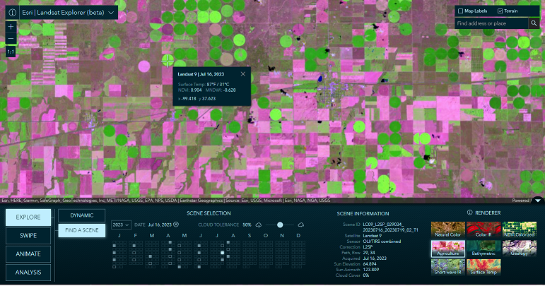

# Imagery Explorer Apps
This repository contains a collection of Imagery Explorer web applications developed by Esri's ArcGIS Living Atlas team.

## Table of Content
- [Getting Started](#getting-started)
- [Landsat Explorer](#landsat-explorer)
- [Resources](#resources)
- [Issues](#issues)
- [Contributing](#contributing)
- [Licensing](#licensing)

## Getting Started
Before you begin, make sure you have a fresh version of [Node.js](https://nodejs.org/en/) and NPM installed. The current Long Term Support (LTS) release is an ideal starting point.

To get started, clone this repository (or your fork) to your local machine:
```sh
git clone https://github.com/vannizhang/imagery-explorer-apps.git
```

Navigate to the root directory of the project and install the necessary packages (dependencies):
```sh
npm install
```

## Landsat Explorer

The Landsat Explorer app offers an intuitive user experience, it leverages a variety of ArcGIS capabilities to explore and begin to unlock the wealth of information that Landsat provides. 

[View it live](https://livingatlas.arcgis.com/landsatexplorer/)



### Features:
- Visual exploration of a Dynamic global mosaic of the best available Landsat scenes.
- On-the-fly multispectral band combinations and indices for visualization and analysis.
- Interactive Find a Scene by location, sensor, time, and cloud cover.
- Visual change by time, and comparison of different renderings, with Swipe and Animation modes.
- Analysis such as threshold masking and temporal profiles for vegetation, water, land surface temperature, and more.

### Usage
Before running the application, update the `landsat-level-2` URLs in the [`config.json`](./src/config.json) to use the URL of the your service. 

[`config.json`](./src/config.json):
```js
{
    //...
    "services": {
        "landsat-level-2": {
            "development": "URL_OF_YOUR_PROXY_SERVICE_FOR_LANDSAT_LEVEL_2",
            "production": "URL_OF_YOUR_PROXY_SERVICE_FOR_LANDSAT_LEVEL_2"
        }
    }
}
```

To run and test the app on your local machine:
```sh
npm run start-landsat
```

To build the app, you can run the command below, this will place all files needed for deployment into the `/dist/landsat` directory.
```sh
npm run build-landsat
```

### Landsat Level-2 Imagery Service Licensing
- Source Image Products - USGS. USGS-authored or produced data and information are considered to be in the U.S. Public Domain and may be used without restriction. [Acknowledging or Crediting USGS](https://www.usgs.gov/information-policies-and-instructions/acknowledging-or-crediting-usgs)
- Image Service - Esri. This work is licensed under the Esri Master License Agreement. [View Summary](https://downloads2.esri.com/arcgisonline/docs/tou_summary.pdf) | [View Terms of Use](https://www.esri.com/en-us/legal/terms/full-master-agreement)

## Issues
Find a bug or want to request a new feature?  Please let us know by submitting an issue.

## Resources
- [Landsat Level-2 archive available in Living Atlas](https://www.esri.com/arcgis-blog/products/arcgis-living-atlas/imagery/landsat-level-2-science-products-and-landsat-explorer/)

## Contributing

Esri welcomes contributions from anyone and everyone. Please see our [guidelines for contributing](https://github.com/esri/contributing).

## Licensing

Copyright 2024 Esri

Licensed under the Apache License, Version 2.0 (the "License");
you may not use this file except in compliance with the License.
You may obtain a copy of the License at

   http://www.apache.org/licenses/LICENSE-2.0

Unless required by applicable law or agreed to in writing, software
distributed under the License is distributed on an "AS IS" BASIS,
WITHOUT WARRANTIES OR CONDITIONS OF ANY KIND, either express or implied.
See the License for the specific language governing permissions and
limitations under the License.

A copy of the license is available in the repository's [license.txt](https://github-admin.esri.com/doc/LICENSE.txt) file.

