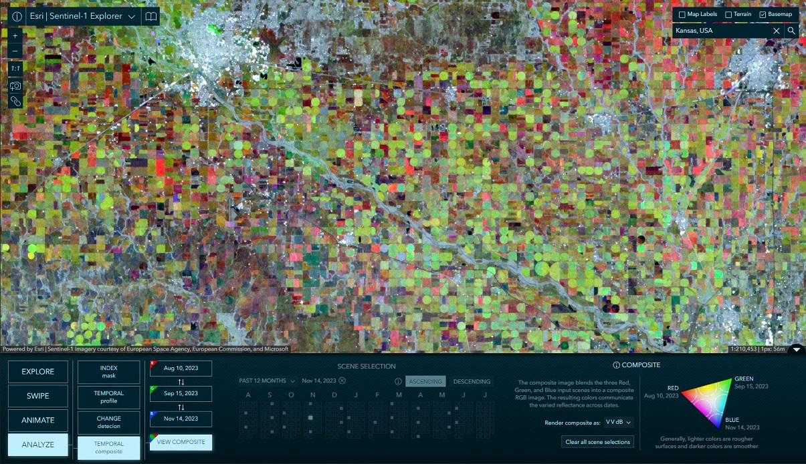

# Imagery Explorer Apps
This repository contains a collection of Imagery Explorer web applications developed by Esri's ArcGIS Living Atlas team.

## Table of Content
- [Getting Started](#getting-started)
- [Landsat Explorer](#landsat-explorer)
- [Sentinel-2 Landcover Explorer](#sentinel-2-land-cover-explorer)
- [Sentinel-1 Explorer](#sentinel-1-explorer)

## Getting Started
Before you begin, make sure you have a fresh version of [Node.js](https://nodejs.org/en/) and NPM installed. The current Long Term Support (LTS) release is an ideal starting point.

To get started, clone this repository (or your fork) to your local machine:
```sh
git clone https://github.com/Esri/imagery-explorer-apps.git
```

Navigate to the root directory of the project and install the necessary packages (dependencies):
```sh
npm install
```

## Landsat Explorer

The Landsat Explorer app offers an intuitive user experience, it leverages a variety of ArcGIS capabilities to explore and begin to unlock the wealth of information that Landsat provides. 

[View it live](https://livingatlas.arcgis.com/landsatexplorer/)


### Features:
- Visual exploration of a Dynamic global mosaic of the best available Landsat scenes.
- On-the-fly multispectral band combinations and indices for visualization and analysis.
- Interactive Find a Scene by location, sensor, time, and cloud cover.
- Visual change by time, and comparison of different renderings, with Swipe and Animation modes.
- Analysis such as threshold masking and temporal profiles for vegetation, water, land surface temperature, and more.

### Usage
Before running the application, update the `landsat-level-2` URLs in the [`config.json`](./src/config.json) to use the URL of your service proxy for [Landsat Level-2](https://landsat.imagery1.arcgis.com/arcgis/rest/services/LandsatC2L2/ImageServer). 

[`config.json`](./src/config.json):
```js
{
    //...
    "services": {
        "landsat-level-2": {
            "development": "URL_OF_YOUR_PROXY_SERVICE_FOR_LANDSAT_LEVEL_2",
            "production": "URL_OF_YOUR_PROXY_SERVICE_FOR_LANDSAT_LEVEL_2"
        }
    }
}
```

To run and test the app on your local machine:
```sh
npm run start:landsat
```

To build the app, you can run the command below, this will place all files needed for deployment into the `/dist/landsat` directory.
```sh
npm run build:landsat
```

### Resources
- [Landsat Level-2 archive available in Living Atlas](https://www.esri.com/arcgis-blog/products/arcgis-living-atlas/imagery/landsat-level-2-science-products-and-landsat-explorer/)
- [Landsat Explorer: Earth Science and Observation for All](https://www.esri.com/arcgis-blog/products/arcgis-living-atlas/imagery/landsat-explorer-earth-science-and-observation-for-all/)
- [Landsat Level-2 RFTs](./assets/LandsatC2L2FunctionTemplates/): Raster Function Templates of the Landsat Level-2 service for the Raster Functions that are utilized by the app.

### Landsat Level-2 Imagery Service Licensing
- Source Image Products - USGS. USGS-authored or produced data and information are considered to be in the U.S. Public Domain and may be used without restriction. [Acknowledging or Crediting USGS](https://www.usgs.gov/information-policies-and-instructions/acknowledging-or-crediting-usgs)
- Image Service - Esri. This work is licensed under the Esri Master License Agreement. [View Summary](https://downloads2.esri.com/arcgisonline/docs/tou_summary.pdf) | [View Terms of Use](https://www.esri.com/en-us/legal/terms/full-master-agreement)

## Sentinel-2 Land Cover Explorer

Land use land cover (LULC) maps are an increasingly important tool for decision-makers in many industry sectors and developing nations around the world. The information provided by these maps helps inform policy and land management decisions by better understanding and quantifying the impacts of earth processes and human activity.

The Sentinel-2 Land Cover Explorer app provides dynamic visual and statistical change by comparing annual slices of the Sentinel-2 10m Land Use/Land Cover data as you explore the map.

[View it live](https://livingatlas.arcgis.com/landcoverexplorer/)


### Features:
- Visual change analysis with either ‘Step Mode’ or ‘Swipe Mode’
- Dynamic statistical change analysis by year, map extent, and class
- Filter by selected land cover class
- Regional class statistics summarized by administrative boundaries
- Imagery mode for visualization and comparison of the source imagery
- Select and dynamically change imagery renderings
- Data download for offline use

### Usage
To run and test the app on your local machine:
```sh
npm run start:landcover
```

To build the app, you can run the command below, this will place all files needed for deployment into the `/dist/landcover-explorer` directory.
```sh
npm run build:landcover
```

### Resources
- [Global Land Cover Revealed](https://www.esri.com/arcgis-blog/products/arcgis-living-atlas/imagery/global-land-cover-revealed/)
- [Sentinel-2 10m Land Use/Land Cover Time Series](https://www.arcgis.com/home/item.html?id=cfcb7609de5f478eb7666240902d4d3d)

## Sentinel-1 Explorer

Sentinel-1 SAR imagery helps to track and document land use and land change associated with climate change, urbanization, drought, wildfire, deforestation, and other natural processes and human activity.

Through an intuitive user experience, this app leverages a variety of ArcGIS capabilities to explore and begin to unlock the wealth of information that Sentinel-1 provides.

[View it live](https://livingatlas.arcgis.com/sentinel1explorer/)



### Features:
- Visual exploration of a Dynamic global mosaic of the best available Sentinel-1 scenes.
- On-the-fly multispectral band combinations and indices for visualization and analysis.
- Interactive Find a Scene by location, sensor, time, and cloud cover.
- Visual change by time, and comparison of different renderings, with Swipe and Animation modes.
- Analysis such as threshold masking and temporal profiles for vegetation, water, land surface temperature, and more.

### Usage
Before running the application, update the `"sentinel-1` URLs in the [`config.json`](./src/config.json) to use the URL of your service proxy for [Sentinel-1 RTC](https://sentinel1.imagery1.arcgis.com/arcgis/rest/services/Sentinel1RTC/ImageServer). 

[`config.json`](./src/config.json):
```js
{
    //...
    "services": {
        "sentinel-1": {
            "development": "URL_OF_YOUR_PROXY_SERVICE_FOR_SENTINEL_1",
            "production": "URL_OF_YOUR_PROXY_SERVICE_FOR_SENTINEL_1"
        }
    }
}
```

To run and test the app on your local machine:
```sh
npm run start:sentinel1
```

To build the app, you can run the command below, this will place all files needed for deployment into the `/dist/sentinel1-explorer` directory.
```sh
npm run build:sentinel1
```

### Resources
- [Sentinel-1 Explorer: Observing Earth in a different light](https://www.esri.com/arcgis-blog/products/arcgis-living-atlas/imagery/sentinel-1-explorer-observing-earth-in-a-different-light/)
- [ Sentinel-1 RTC imagery from Living Atlas](https://www.arcgis.com/home/item.html?id=ca91605a3261409aa984f01f7d065fbc)

### Sentinel-1 RTC Imagery Service Licensing
- Sentinel-1 RTC Source Imagery – The source imagery is hosted on Microsoft Planetary Computer under an open [CC BY 4.0 license](https://creativecommons.org/licenses/by/4.0/).
- Sentinel-1 RTC Image Service - This work is licensed under the Esri Master License Agreement. [View Summary](https://downloads2.esri.com/arcgisonline/docs/tou_summary.pdf) | [View Terms of Use](https://www.esri.com/en-us/legal/terms/full-master-agreement)


## Issues
Find a bug or want to request a new feature?  Please let us know by submitting an issue.

## Contributing

Esri welcomes contributions from anyone and everyone. Please see our [guidelines for contributing](https://github.com/esri/contributing).

## Licensing

Copyright 2024 Esri

Licensed under the Apache License, Version 2.0 (the "License");
you may not use this file except in compliance with the License.
You may obtain a copy of the License at

   http://www.apache.org/licenses/LICENSE-2.0

Unless required by applicable law or agreed to in writing, software
distributed under the License is distributed on an "AS IS" BASIS,
WITHOUT WARRANTIES OR CONDITIONS OF ANY KIND, either express or implied.
See the License for the specific language governing permissions and
limitations under the License.

A copy of the license is available in the repository's [LICENSE](./LICENSE) file.

